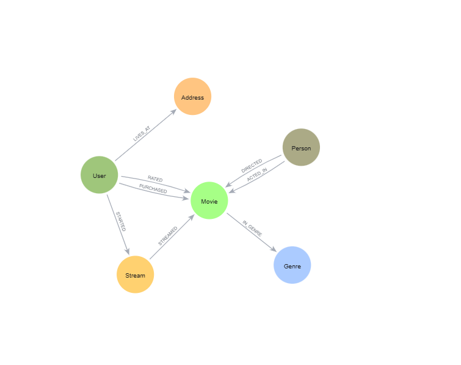

= Extended Recommendations Dataset

This is an extended version of the link:https://github.com/neo4j-graph-examples/recommendations[recommendations^] dataset.

The original recommendations dataset was extracted from the dump file into a series of CSV files.

Faker is used to generate additional data including:

* Additional `User` properties
* `Address` nodes and `LIVES_AT` relationships
* `Stream` nodes and `STARTED` and `STREAMED` relationships
* `PURCHASED` relationships between `User` and `Movie`

== Data Model



== Structure

- data/csv - CSV files containing the data
- data/cypher - Cypher scripts to export / load the data into Neo4j
- data/data-importer - Data Importer models for the original and extended datasets
- generate - Python scripts to generate the extended dataset
- requirements.txt - Python dependencies

== Generate the dataset

To "re-generate" the dataset, run:

```
python generate/generate.py
```

Constants can be adjusted in `generate/constants.py` to change the number of entities generated.